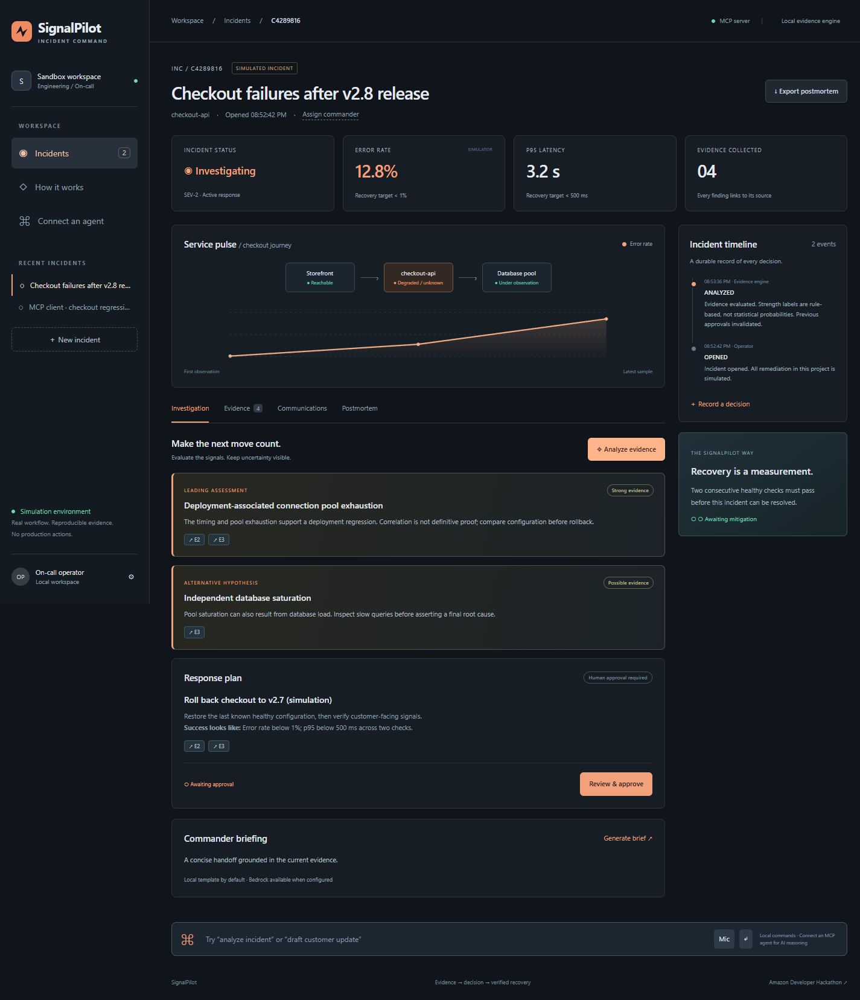

# SignalPilot

**Evidence → decision → verified recovery.**

[](https://github.com/zephyr45/signalpilot/actions/workflows/verify.yml)

A Java/Spring Boot incident command workbench and self-hosted MCP server for the Amazon Developer Hackathon's Alexa+ track. Investigate an outage, inspect the supporting evidence, approve a simulated response, verify recovery and export the postmortem.



## Run in two commands

Prefer a prebuilt executable? The [v1.0.0 release](https://github.com/zephyr45/signalpilot/releases/tag/v1.0.0) contains the JAR, narrated demo and source archive. Run the downloaded JAR with `java -jar signalpilot-1.0.0.jar` (JDK 21 required).

Requires **JDK 21**. Maven is downloaded by the included wrapper; Node is only needed for optional independent MCP verification.

Windows PowerShell:

```powershell
.\mvnw.cmd verify
java -jar target/signalpilot-1.0.0.jar
```

macOS / Linux:

```sh
./mvnw verify
java -jar target/signalpilot-1.0.0.jar
```

Open **http://127.0.0.1:8091**. Click **Launch checkout incident**. No accounts, model keys or hardware are required. Data persists in `./data/signalpilot.mv.db`; stop the server before backing up that file.

## Judge the complete workflow

1. Launch checkout incident. Four evidence records explain the simulated alert, deployment, pool exhaustion and healthy upstream provider.
2. Click **Analyze evidence**. Inspect the leading hypothesis, alternative explanation and source IDs.
3. Click **Review & approve**, then **Approve simulation**, then **Run simulation**. These actions never contact production infrastructure.
4. Click **Check recovery** once: resolution is unavailable. Try **Simulate failed check**: the gate resets. Pass two consecutive checks to unlock resolution.
5. Resolve, open **Communications**, draft a customer update, and export the Markdown postmortem.
6. Try **New incident → Payment provider timeout cascade**: SignalPilot recommends a circuit breaker rather than a checkout rollback. **Insufficient evidence** proposes no remediation.

## Connect an MCP client

Transport: **Streamable HTTP**. Endpoint: `http://127.0.0.1:8091/mcp`. The official Spring AI server negotiates **2025-11-25**; this is checked in integration tests. This repository implements the self-hosted MCP path; it does not claim a deployed Alexa+ skill or a production Alexa account connection.

Illustrative client configuration (adapt the syntax to your MCP client):

```json
{"mcpServers":{"signalpilot":{"type":"http","url":"http://127.0.0.1:8091/mcp"}}}
```

Tools: `list_incidents`, `create_incident`, `get_incident`, `ingest_evidence`, `analyze_incident`, `record_decision`, `assign_commander`, `draft_status_update`, `generate_postmortem`.

Click **MCP → Run live MCP check** in the dashboard to watch real protocol initialization, tool discovery and a read-only tool invocation against the same server. This is a protocol diagnostic, not an AI model or prerecorded response.

Mutation tools require the current `revision` returned by `get_incident` and a fresh `requestId`. Retry the same operation with the same ID after an uncertain response. Approval and execution are dashboard operations, absent from the agent tool surface. That separation is a tool-design boundary; a holder of the shared API token can call the REST API.

Independent TypeScript SDK verification, against the running app:

```sh
npm ci
npm run test:mcp
```

The script performs a real session handshake, discovers tools, creates and analyzes an incident, drafts a customer update, exports an unresolved postmortem and checks missing-incident errors. It writes `artifacts/mcp-verification.json` and leaves a clearly named test incident.

## Where AI runs

An MCP client supplies its own model and calls the real server tools. The dashboard's default evidence evaluator and command router are deterministic and explicitly labeled; they are not an LLM. This keeps testing reproducible and never invents a provider response.

Optional **Amazon Bedrock Converse** briefing:

```powershell
$env:AI_PROVIDER='bedrock'
$env:AWS_REGION='us-east-1'
$env:BEDROCK_MODEL='amazon.nova-lite-v1:0'
# Supply an AWS profile or IAM role with bedrock:InvokeModel and access to your chosen model.
java -jar target/signalpilot-1.0.0.jar
```

Click **Generate brief**. The provider and model are displayed next to the output. Cloud errors are shown explicitly. Bedrock has a bounded timeout and token limit; credentials use the AWS default provider chain and are never sent to the browser. Model access and charges depend on your account. This optional path must be verified with real credentials before claiming AWS usage in a submission.

## Engineering decisions

- Java 21, Spring Boot 4.0.8, Spring AI 2.0.1, Spring JDBC, H2 and AWS SDK.
- Transactional row locks plus revision checks prevent stale or conflicting actions.
- New evidence invalidates previous proposals and approvals.
- Resolution requires two consecutive healthy observations after mitigation.
- Qualitative evidence strength and alternative hypotheses expose uncertainty.
- Persisted timeline and evidence references survive restart; Markdown export preserves the decision trail.
- Responsive, keyboard-accessible UI with safe text rendering and no runtime CDN dependencies.
- Optional browser dictation fills the command box; review and send explicitly. Text works everywhere.

## Container / remote use

Set `SIGNALPILOT_TOKEN` to a unique random value, then `docker compose up --build`. Enter the same token using the dashboard settings button. Compose binds only to localhost and persists data in a named volume. The Docker build runs tests. Docker runtime verification is reported separately in `docs/verification.md`.

For a remote host set `SIGNALPILOT_BIND=0.0.0.0`, a token and `SIGNALPILOT_ORIGIN=https://your-host`. Put the app behind HTTPS, restrict network access and persist `/app/data`. Send `Authorization: Bearer …` from MCP clients. Port defaults to 8091; override `PORT` as needed. There is no multi-user identity, OAuth or tenant isolation in this hackathon version.

## Verification and submission materials

- [Verification evidence](docs/verification.md)
- [Architecture](docs/architecture.md)
- [Submission draft](devpost-submission.md)
- [Demo script and recording](docs/demo-script.md)
- [Product feedback and friction log](docs/product-feedback.md)

All sample telemetry, fixes and recovery checks are simulated. The project is a functional hackathon prototype, not a production incident-management service. No measured customer outcomes or contest award are claimed.

MIT licensed. Built with assistance from Codex.
